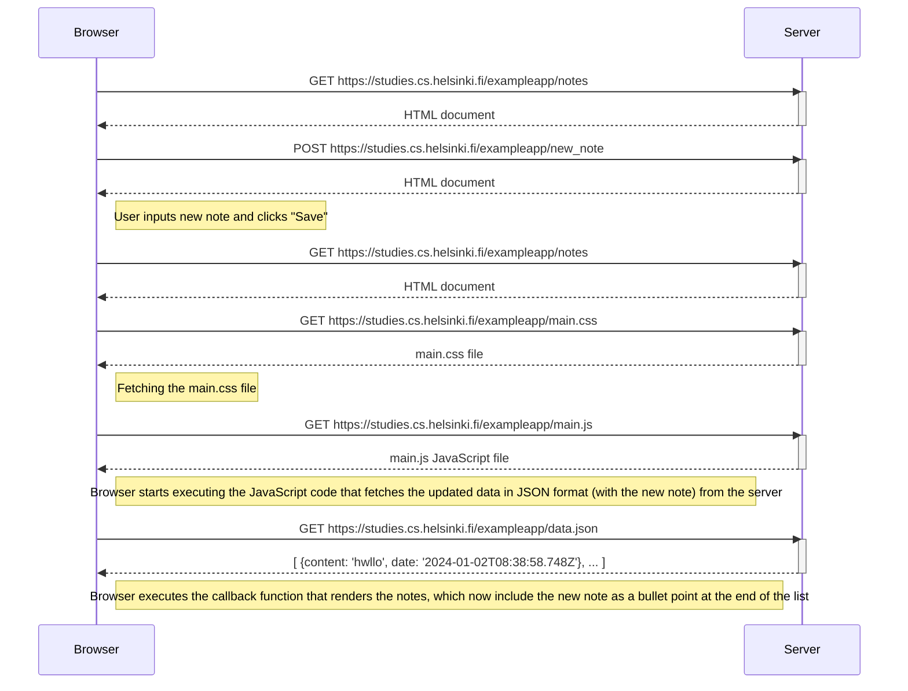

```mermaid
sequenceDiagram
    participant Browser
    participant Server

    Browser->>Server: GET https://studies.cs.helsinki.fi/exampleapp/notes
    activate Server
    Server-->>Browser: HTML document
    deactivate Server

    Browser->>Server: POST https://studies.cs.helsinki.fi/exampleapp/new_note
    activate Server
    Server-->>Browser: HTML document
    deactivate Server
    Note right of Browser: User inputs new note and clicks "Save"

    Browser->>Server: GET https://studies.cs.helsinki.fi/exampleapp/notes
    activate Server
    Server-->>Browser: HTML document
    deactivate Server

    Browser->>Server: GET https://studies.cs.helsinki.fi/exampleapp/main.css
    activate Server
    Server-->>Browser: main.css file
    deactivate Server
    Note right of Browser: Fetching the main.css file

    Browser->>Server: GET https://studies.cs.helsinki.fi/exampleapp/main.js
    activate Server
    Server-->>Browser: main.js JavaScript file
    deactivate Server
    Note right of Browser: Browser starts executing the JavaScript code that fetches the updated data in JSON format (with the new note) from the server

    Browser->>Server: GET https://studies.cs.helsinki.fi/exampleapp/data.json
    activate Server
    Server-->>Browser: [ {content: 'hwllo', date: '2024-01-02T08:38:58.748Z'}, ... ]
    deactivate Server    
    Note right of Browser: Browser executes the callback function that renders the notes, which now include the new note as a bullet point at the end of the list 
    
```    
