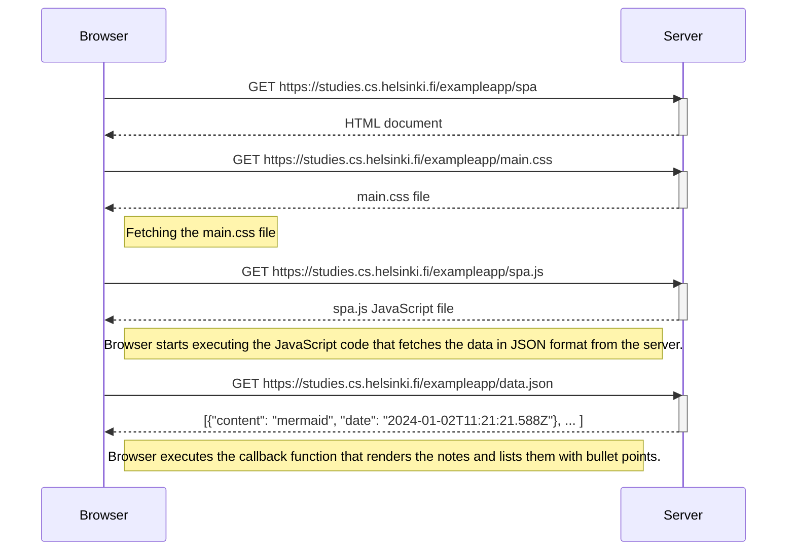

```mermaid

sequenceDiagram
    participant Browser
    participant Server

    Browser->>Server: GET https://studies.cs.helsinki.fi/exampleapp/spa
    activate Server
    Server-->>Browser: HTML document
    deactivate Server

    Browser->>Server: GET https://studies.cs.helsinki.fi/exampleapp/main.css
    activate Server
    Server-->>Browser: main.css file
    deactivate Server
    Note right of Browser: Fetching the main.css file

    Browser->>Server: GET https://studies.cs.helsinki.fi/exampleapp/spa.js
    activate Server
    Server-->>Browser: spa.js JavaScript file
    deactivate Server
    Note right of Browser: Browser starts executing the JavaScript code that fetches the data in JSON format from the server.

    Browser->>Server: GET https://studies.cs.helsinki.fi/exampleapp/data.json
    activate Server
    Server-->>Browser: [{"content": "mermaid", "date": "2024-01-02T11:21:21.588Z"}, ... ]
    deactivate Server    
    Note right of Browser: Browser executes the callback function that renders the notes and lists them with bullet points. 

```
